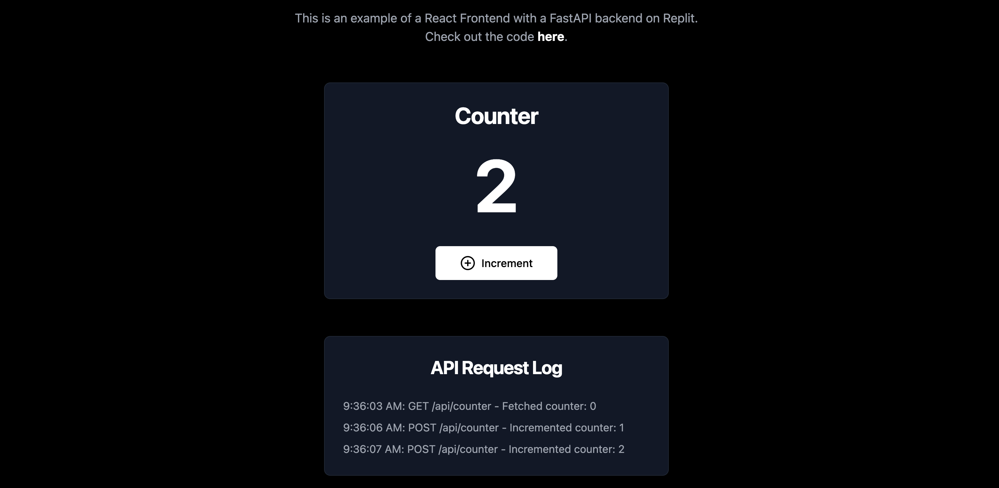

# Fullstack Repl Example

A full-stack application demonstrating the integration of a React frontend with a FastAPI backend on Replit.

To get started, just click "Run." Or check out the live demo [here](https://matts-single-fullstack-repl.replit.app/).

## How it works

The frontend is powered by a React application via Vite. When you click "Run," the Vite development server is what you'll see in the Webview. The counter increments by communicating with the [Python backend](/main.py). 

You can see the Run commands in the [.replit](/.replit) file.

Upon deployment, we build our Vite project into a set of static files, which are hosted by FastAPI. [This](/main.py:23:8) piece of logic tells our app "if this Repl is a deployment, host the static files built by vite on port 5173 _in addition_ to acting as a backend."

If you wanted to use a frontend server rather than a set of static files, you could modify the .replit file to run that server and remove this code.

The build and deploy commands are defined [here](/.replit:14).

## API Endpoints

- GET `/api/counter`: Retrieve the current counter value
- POST `/api/counter`: Increment the counter

## Deployment

The app is configured for easy deployment on Replit. The backend serves the built frontend files in production.